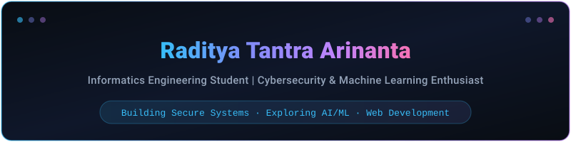
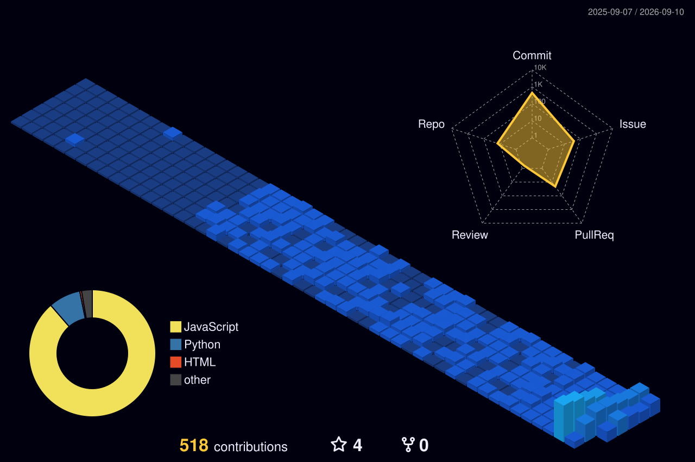
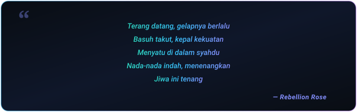

<div align="center">
  
  <!-- Native SVG Header (100% Reliable & Fast) -->
  

  <br><br>

  <!-- Profile Views & Badges -->
  <p align="center">
    
    <a href="https://github.com/radityaarinanta?tab=followers"></a>
    
  </p>

</div>

---

### About Me

```yaml
user: radityaarinanta
name: Raditya Tantra Arinanta
location: Malang, Indonesia
education: Undergraduate Student in Informatics Engineering
interests:
  - Cybersecurity (Intrusion Detection, Network Security, Ethical Hacking)
  - Artificial Intelligence (Machine Learning, Deep Learning, Computer Vision)
  - Modern Web Development
currently_learning: Advanced Threat Detection & Neural Network Architectures
open_for: Research Collaborations, Security Research, Open Source Projects
fun_fact: "Passionate about understanding how systems work under the hood and how to secure them."
```

---

### Tech Stack & Skills

<div align="center">

#### Programming Languages
<p>
  
  
  
  
  
  
  
  
</p>

#### Cybersecurity & Networking
<p>
  
  
  
  
  
  
</p>

#### AI, Machine Learning & Data Science
<p>
  
  
  
  
  
  
</p>

#### Developer Tools & Environments
<p>
  
  
  
  
  
  
</p>

</div>

---

### GitHub Analytics

<div align="center">
  
  
</div>

---

### Featured Projects

| Project | Description | Tech Stack | Repository |
| :--- | :--- | :--- | :---: |
| **inspire-vulscan** | Vulnerability scanning and security assessment tool | `Python` `Security` | [View Repository](https://github.com/radityaarinanta/inspire-vulscan) |
| **monitor-stocks** | Real-time stock monitoring web application | `HTML5` `CSS3` `JavaScript` | [View Repository](https://github.com/radityaarinanta/monitor-stocks) |

---

### 3D Contribution Activity

<div align="center">
  <picture>
    <source media="(prefers-color-scheme: dark)" srcset="./profile-3d-contrib/profile-night-view.svg">
    <source media="(prefers-color-scheme: light)" srcset="./profile-3d-contrib/profile-green-animate.svg">
    
  </picture>
</div>

---

### Connect With Me

<div align="center">

<a href="https://www.linkedin.com/in/raditya-tantra-arinanta-17754a36b" target="_blank">
  
</a>
<a href="mailto:radityatantraarinanta@gmail.com" target="_blank">
  
</a>
<a href="https://github.com/radityaarinanta" target="_blank">
  
</a>

<br><br>



</div>
